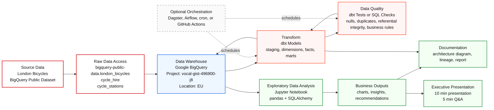

# London Bicycles Project Architecture

## Plain-English Flow

1. The project starts from the public London Bicycles dataset already hosted in BigQuery.
2. We connect to the source tables through your Google Cloud project.
3. BigQuery acts as the data warehouse.
4. dbt transforms the raw source data into clean staging models, dimensions, fact tables, and analysis marts.
5. Data quality checks validate important rules such as non-null dates, valid durations, unique trip IDs, and station relationships.
6. Python and Jupyter are used for exploratory analysis and charts.
7. The final outputs become the technical documentation, report, and executive slide deck.
8. Orchestration is optional for this assignment, but we can include it as a future enhancement.

